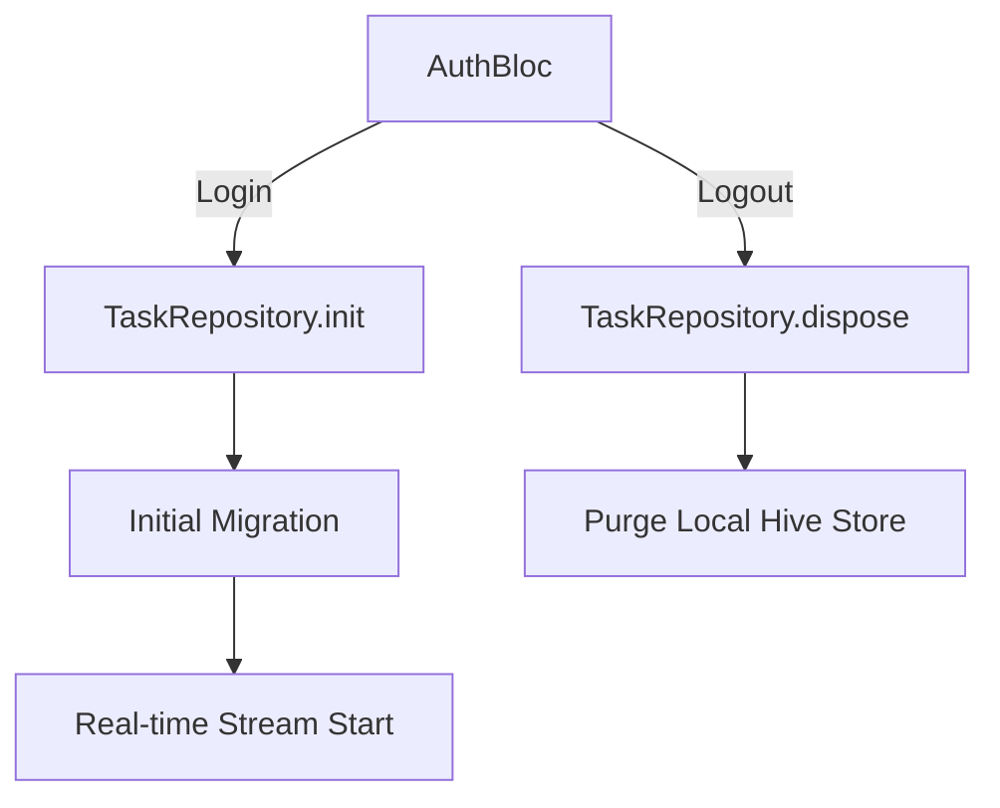

# Enterprise Core Engine Guide

This guide details the implementation logic for the "Brain" of a production Flutter app: The Core Engine.

## 1. The Sync Engine (Delta Architecture)

A production sync engine must be reactive and resilient.

### The Bridge Implementation

```dart
abstract class SyncBridge {
  /// The primary entry point for synchronization.
  /// Should perform a "Double Snapshot" comparison.
  Future<void> syncNow();

  /// Listeners for real-time remote updates.
  Stream<List<Entity>> watchRemoteChanges();
}
```

### Conflict Resolution Matrix

| Scenario      | Resolution  | Logic                                             |
| :------------ | :---------- | :------------------------------------------------ |
| Local Newer   | PUSH        | `local.updatedAt > remote.updatedAt`              |
| Remote Newer  | PULL        | `remote.updatedAt > local.updatedAt`              |
| Local Deleted | SYNC DELETE | Propagate `isDeleted` to remote then purge local. |
| Remote Orphan | DOWNLOAD    | If exists on remote but not local, fetch.         |

## 2. The Auth-Data Bridge

The application lifecycle must be tied to the Auth state.

### Multi-Agent Rule:

> **The Auth Repository is the primary trigger for the Task Repository.**



## 3. Resilience & Error Gating

Implement "Circuit Breakers" for external calls.

- **Exponential Backoff**: Use `retry` package for network calls.
- **Fail-Safe Initializers**: `Firebase.initializeApp()` and `Hive.init()` should be wrapped in individual error gates to allow "Partial Mode" (offline-only) if services are down.
